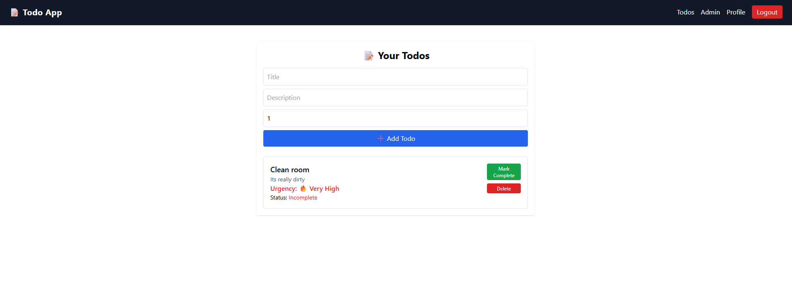

# FastAPI To-do App

## Overview
A full-stack To-do application built with FastAPI backend and React frontend. Users can sign up, log in, create and manage todos. Admin users have special privileges like viewing and deleting all todos.

## Features
- User authentication with JWT tokens
- Role-based access (user/admin)
- CRUD operations on todos
- Responsive and clean UI with React and TailwindCSS
- Password change functionality
- Admin dashboard for managing todos

## Technologies Used
- Backend: FastAPI, SQLAlchemy, PostgreSQL, JWT
- Frontend: React, React Router, Axios, TailwindCSS

